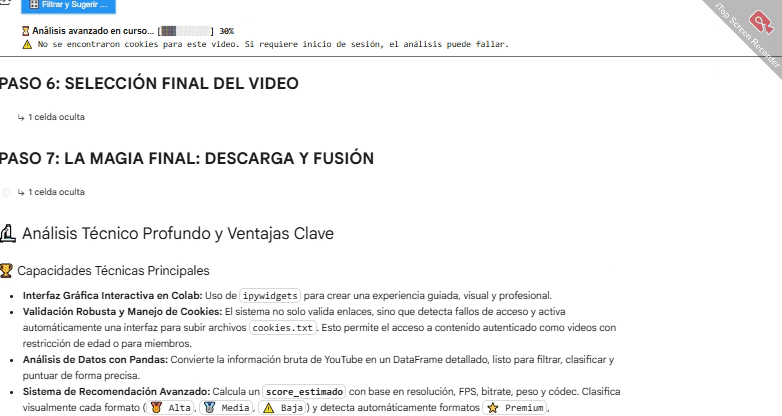

# 🎬 Project NexusDownloader AI — Sistema Inteligente de Descarga y Análisis Multimedia

**Tipo de archivo:** **Python · yt-dlp · ffmpeg · Pandas · ipywidgets**

**Archivos principales del proyecto:**

* `nexus_downloader.py` (lógica principal)
* `widgets/` (interfaz interactiva con ipywidgets)
* `cookies/` (almacenamiento seguro de cookies subidas)

---

## 📑 Descripción

**NexusDownloader AI** es una solución de ingeniería avanzada para la **descarga, análisis y recomendación multimedia** desde YouTube y plataformas compatibles.

Permite:

* Descargar, analizar, recomendar y fusionar flujos de video/audio de forma **inteligente**, entregando resultados de máxima calidad.
* Gestionar casos restringidos (edad, privados, miembros, premium) usando **visitorData** o **cookies proporcionadas por el usuario**.
* Integrarse en entornos **Jupyter/Colab** con una interfaz interactiva (**ipywidgets**) y caché de metadatos.

> ⚠️ **Aviso legal / privacidad:** Usa esta herramienta solo para contenidos de los que tengas derecho. Las cookies las proporciona el usuario; la herramienta **no extrae ni envía credenciales**.

---

## 🎥 Demo

🔗 **GIFs demostrativos** mostrando las principales funcionalidades del sistema:

1. **Validación de enlace con fallback inteligente**
   .gif)

2. **Tabla de formatos analizados con Pandas**
   .JPG)

3. **Recomendaciones automáticas de formatos**
   

4. **Descarga y fusión en tiempo real con ffmpeg**
   .gif)

5. **Acceso a videos Premium, privados o con restricción**
   .gif)

  
---
## ✨ Características principales

🔹 **1. Validación Inteligente de Enlaces**

* Normaliza y valida cualquier URL.
* Fallback progresivo: estándar → visitorData → cookies.
* Animación de carga ⏳ y mensajes claros.
  .JPG)
  .JPG)
🔹 **2. Análisis Detallado de Formatos**

* Usa `yt-dlp` para extraer todos los formatos.
* Procesa resultados con **Pandas** en tablas interactivas.
* Incluye resolución, FPS, códecs, bitrate, peso, compatibilidad.
  .JPG)
  .JPG)

🔹 **3. Recomendaciones Automáticas**

* 🎧 Mejor audio (bitrate más alto).
* ✅ Video más compatible (H.264).
* 🚀 Video de máxima calidad (VP9/AV1).
* Clasificación: 🥇 Alta · 🥈 Media · ⚠️ Baja.
  .JPG)
  .JPG)

  
🔹 **4. Descarga y Fusión Automática**

* Descarga video y audio en paralelo.
* Combina ambos con **ffmpeg** en un MP4 sin pérdida.
* Barras de progreso y logs en tiempo real.
  .JPG)

🔹 **5. Manejo de Restricciones**

* Compatible con videos Premium, +18, privados o solo miembros.
* Soporta cookies personalizadas (`cookies.txt`).
  

---

## 🛠️ Tecnología

* **Lenguaje principal:** Python 3
* **Descarga y análisis:** yt-dlp · ffmpeg
* **Procesamiento de datos:** Pandas · re · json · glob
* **Interfaz:** ipywidgets · IPython.display
* **Compatibilidad:** Jupyter Notebook · Google Colab

---

## 🧭 Flujo general

1. Usuario ingresa URL.
2. `procesar_enlace` normaliza y valida (`video_id`).
3. Intento 1: prueba estándar con `yt-dlp`.
4. Intento 2: con `visitorData`.
5. Intento 3: subir cookies.
6. Si hay metadata → `analizar_formatos()` ejecuta `yt-dlp -j`.
7. DataFrame con score, clasificación 🥇/🥈/⚠️.
8. Usuario selecciona formato → descarga + fusión con `ffmpeg`.
9. Descarga final en Colab/Jupyter.

---

## 🧠 Estado global y widgets

Diccionario `_state` con:

* `url_validado`, `visitor_data`, `cargando_flag`, `metadata_cache`.
* Widgets: input URL, botón Confirmar/Reset, FileUpload, checkbox VisitorData, botones Analizar/Reanalizar/Descargar JSON.

---

## 🔧 Funciones auxiliares

* `_sanitize_filename(name)`
* `extraer_video_id(url)`
* `corregir_y_validar_url(url)`
* `extraer_visitor_data(url)`
* `yt_dlp_get_title(url, cookies, visitorData)`
* `formato_tamano(bytes_)`
* `find_cookies_for_url(url)`
* `obtener_duracion_video(path)`

---

## 🧾 Análisis de formatos

* Reutiliza `metadata_cache` o genera `info.json` con `yt-dlp -j`.
* DataFrame con columnas: itag, ext, type, resolución, fps, bitrate, peso, códecs.
* Calcula `score_estimado` y clasifica en 🥇/🥈/⚠️.
* Muestra metadatos generales y subtítulos disponibles.

---

## 🎛️ Filtros y recomendaciones

* Dropdowns: extensión, resolución, compatibilidad, tipo.
* Tabla interactiva exportable a `.csv`.
* Sugerencias automáticas (audio, compatibilidad, máxima calidad).

---

## ⬇️ Descarga y fusión

1. Selección de `itag`.
2. Descarga video y audio con `yt-dlp`.
3. Fusión con `ffmpeg -c copy`.
4. Descarga en Colab con `files.download()`.
5. Limpieza opcional de temporales.

---

## 🔐 Manejo de cookies y visitorData

* Busca `cookies_<videoid>.txt` o `cookies_global.txt`.
* Usa `yt-dlp --cookies` si hay cookies.
* `extraer_visitor_data()` como fallback automático.

---

## ⚙️ Optimización en Colab

* `files.download()` para descargas grandes.
* Script keep-alive para evitar desconexión.
* Procesar un enlace a la vez.

---

## ⚖️ Legal y responsabilidad

La herramienta **no fomenta piratería**. El usuario es responsable del uso.
Recomendado: mantener repositorio privado o con licencia MIT + cláusula de uso.

---

## 📦 Releases

* Formato: `nexusdownloader-v1.0.zip`.
* Contenido: `notebooks/`, `src/`, `requirements.txt`, `assets/demo_gifs/`.
* Distribución opcional protegida con contraseña → contacto por email.

---

## 📬 Contacto

📧 **[gabrielce992@gmail.com](mailto:gabrielce992@gmail.com)**

---

## 📝 Changelog (v1.0 — inicial)

* Validación inteligente de enlaces.
* Análisis de formatos con scoring técnico.
* Descarga + fusión con yt-dlp y ffmpeg.
* Manejo de cookies y visitorData.
* Optimización para Colab.

